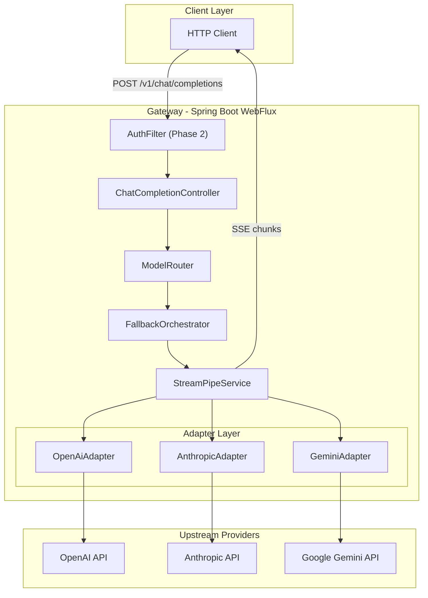
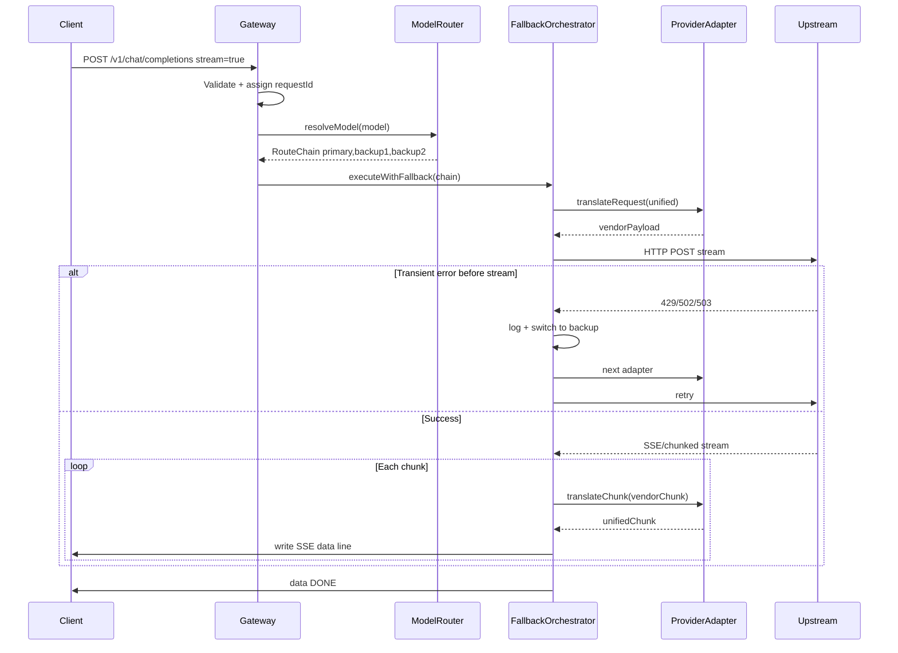
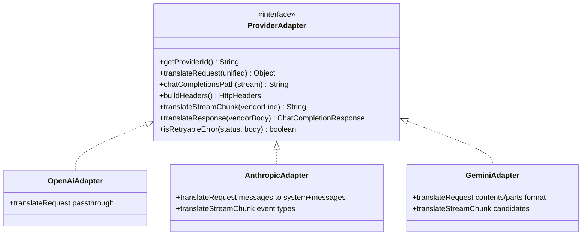
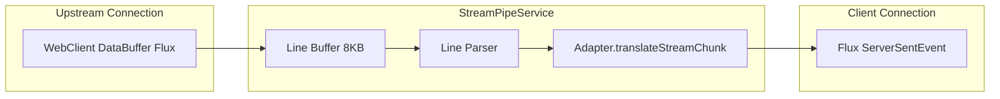
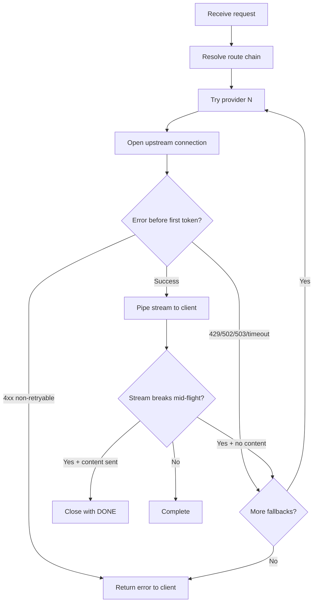
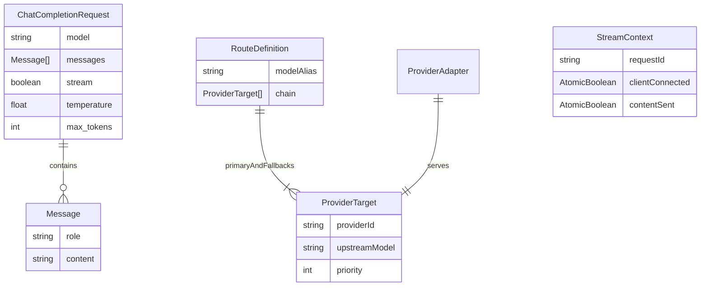

# LLM API Gateway — Architecture

This document describes the architecture of the LLM API Gateway, including component interactions, streaming design, and fallback logic.

## Layered Architecture



## Request Sequence



## Adapter Pattern



Routing logic never branches on vendor JSON shape. `ModelRouter` and `FallbackOrchestrator` depend only on the `ProviderAdapter` interface.

### Translation Differences

| Field | OpenAI | Anthropic | Gemini |
|-------|--------|-----------|--------|
| Messages | `messages[]` | `system` + `messages[]` | `contents[].parts[]` |
| Stream format | SSE `data:` JSON | SSE `event:` + JSON | SSE JSON |
| Model param | `model` | `model` | `model` in URL path |
| Auth header | `Authorization: Bearer` | `x-api-key` + `anthropic-version` | `x-goog-api-key` (query param) |

## Stream Piping



**Implementation:**

- Upstream: `WebClient` with `bodyToFlux(DataBuffer)` — no full-response buffering
- Downstream: `Flux<ServerSentEvent<String>>` with flush per event
- Line parsing buffers incomplete lines until `\n` is received
- Client disconnect triggers `doOnCancel` → upstream subscription disposed

## Fallback Logic



**Retryable:** 408, 429, 500, 502, 503, 504, IOExceptions, timeouts  
**Non-retryable:** 400, 401, 403, 404

## Entity Model



## Timeouts

| Timeout | Default | Scope |
|---------|---------|-------|
| Connect | 5s | TCP to upstream |
| Read (first byte) | 30s | Time to first token |
| Read (inter-chunk) | 120s | Idle between chunks |
| Total request | 300s | Hard ceiling |

Configured in `application.yml` under `gateway.timeouts` and applied via Reactor Netty `HttpClient`.

## Cross-Cutting Concerns

- **RequestIdFilter** — Generates/propagates `X-Request-Id` → SLF4J MDC
- **GlobalExceptionHandler** — Maps validation → 400, unknown model → 404, exhausted fallbacks → 503
- **GatewayHealthIndicator** — Verifies routes are loaded
- **AuthFilter (Phase 2 stub)** — Bearer token validation when `gateway.auth.enabled=true`

## Package Structure

```
com.gateway/
├── config/          WebClient, routes, Jackson, properties
├── controller/      ChatCompletionController
├── dto/             Request/response DTOs
├── routing/         ModelRouter, ProviderRegistry, RouteDefinition
├── fallback/        FallbackOrchestrator
├── streaming/       StreamPipeService, StreamContext
├── adapter/         ProviderAdapter + vendor implementations
├── exception/       GatewayException, GlobalExceptionHandler
├── filter/          RequestIdFilter, AuthFilter
└── health/          GatewayHealthIndicator
```
